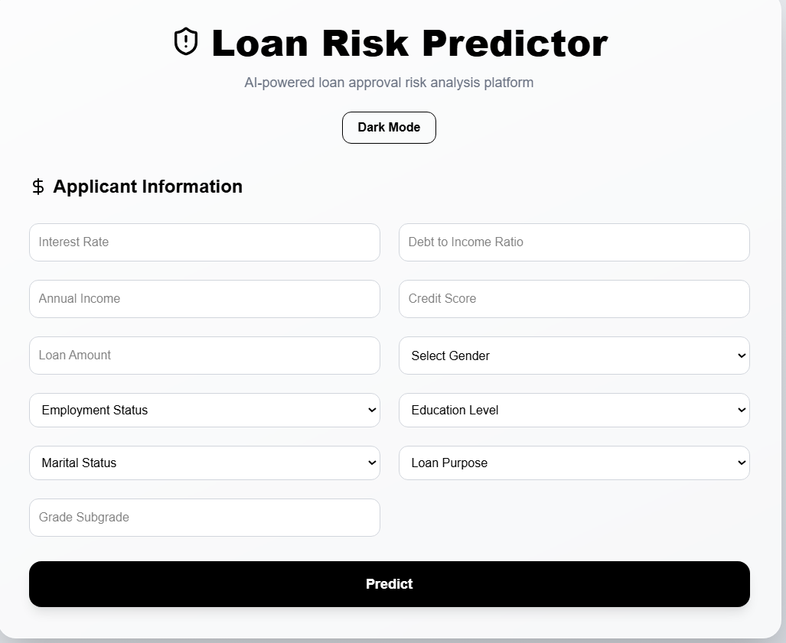
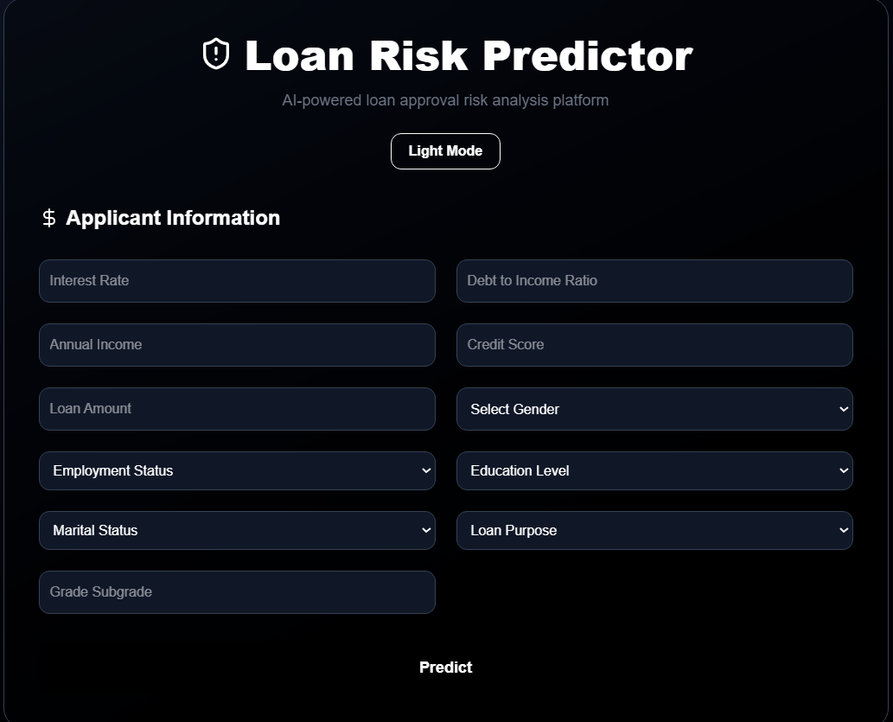
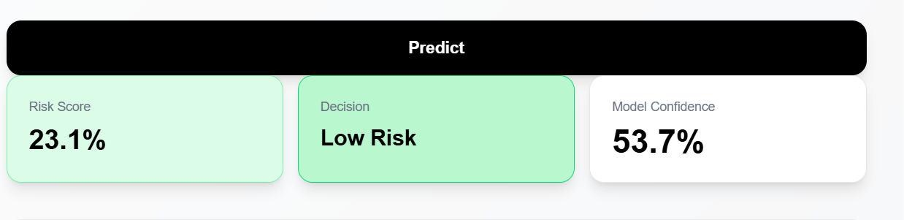
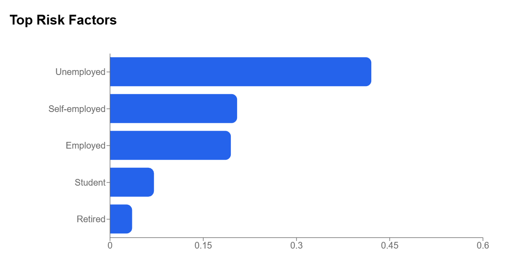

# Loan Risk Predictor

AI-powered loan risk prediction platform with explainable AI, interactive analytics dashboard, and cloud deployment.

---

## Live Demo

Frontend:
https://loan-risk-app-topaz.vercel.app/

Backend API:
https://loan-backend-324407065806.asia-south1.run.app/docs

---

## Features

- Loan default risk prediction
- Explainable AI using SHAP
- Interactive analytics dashboard
- Dark mode UI
- Responsive frontend
- Cloud deployment
- FastAPI backend
- XGBoost inference pipeline
- Feature importance visualization
- Dockerized backend

---

## Tech Stack

### Frontend
- Next.js
- TypeScript
- Tailwind CSS
- Recharts

### Backend
- FastAPI
- Python
- XGBoost
- SHAP
- Scikit-learn

### Deployment
- Vercel
- Google Cloud Run
- Docker

---

## System Architecture

```text
Next.js Frontend
        ↓
Vercel Hosting
        ↓
FastAPI Backend
        ↓
Google Cloud Run
        ↓
XGBoost + SHAP
```

---


## Application Screenshots

### Homepage (Light Mode)



---

### Homepage (Dark Mode)



---

### Prediction Dashboard



---

### Feature Importance Analysis



---

### FastAPI Backend Documentation


---

## Model Explainability

The application provides feature importance analytics using XGBoost feature importance scores.

Users can visualize:
- Top contributing features
- Risk-driving factors
- Model confidence
- Feature importance analytics

## Local Development

### Frontend

```bash
cd webapp
npm install
npm run dev
```

### Backend

```bash
cd backend
pip install -r requirements.txt
uvicorn app.main:app --reload
```

---

## Environment Variables

### Frontend (`.env.local`)

```env
NEXT_PUBLIC_API_URL=https://loan-backend-324407065806.asia-south1.run.app
```

---

## API Endpoint

### POST `/predict`

Example request:

```json
{
  "interest_rate": 12.5,
  "employment_status": "Employed",
  "debt_to_income_ratio": 30,
  "annual_income": 75000,
  "credit_score": 700,
  "loan_purpose": "Business",
  "loan_amount": 15000,
  "education_level": "Bachelor",
  "marital_status": "Single",
  "grade_subgrade": "B2",
  "gender": "Male"
}
```

---

## Future Improvements

- User authentication
- Prediction history
- PDF report generation
- Advanced SHAP visualizations
- Threshold optimization
- Database integration
- Real-time monitoring

---

## Author

Vikash Kumar Mahato
